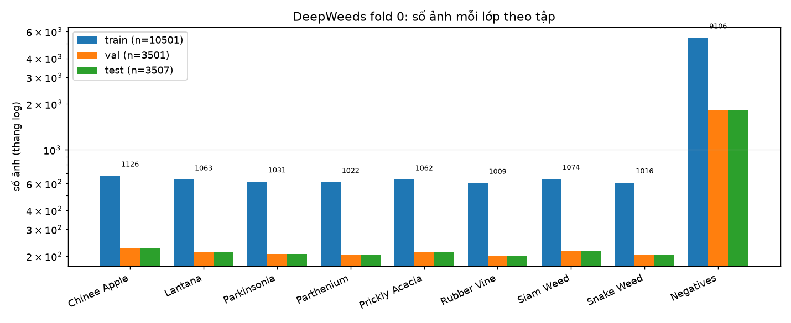
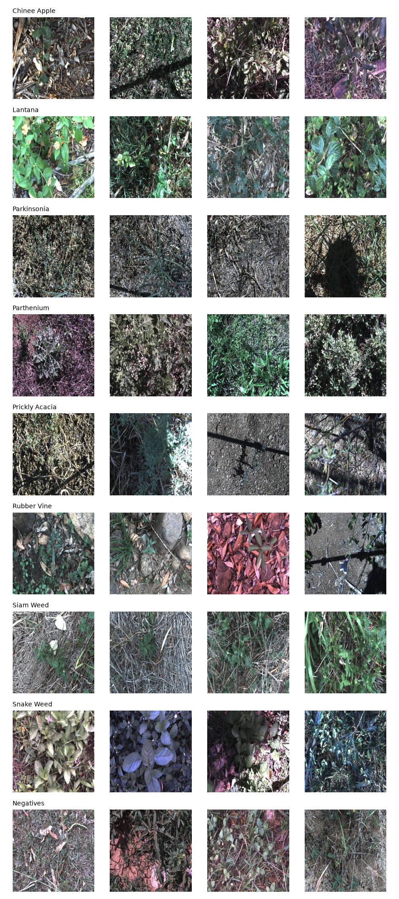
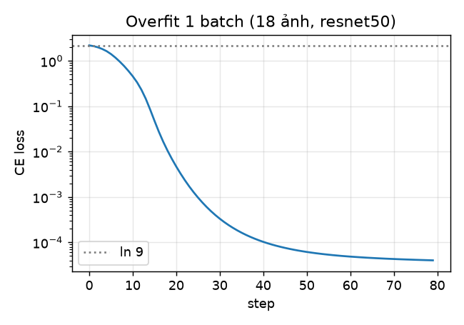
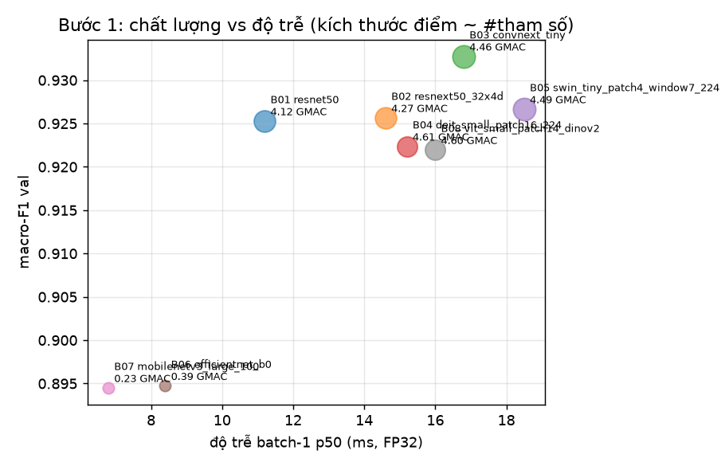
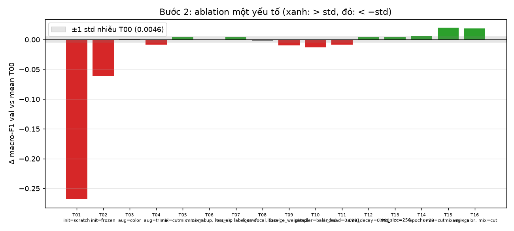
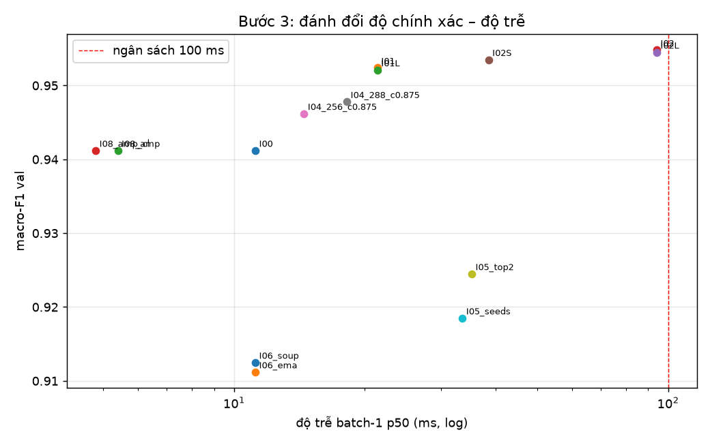
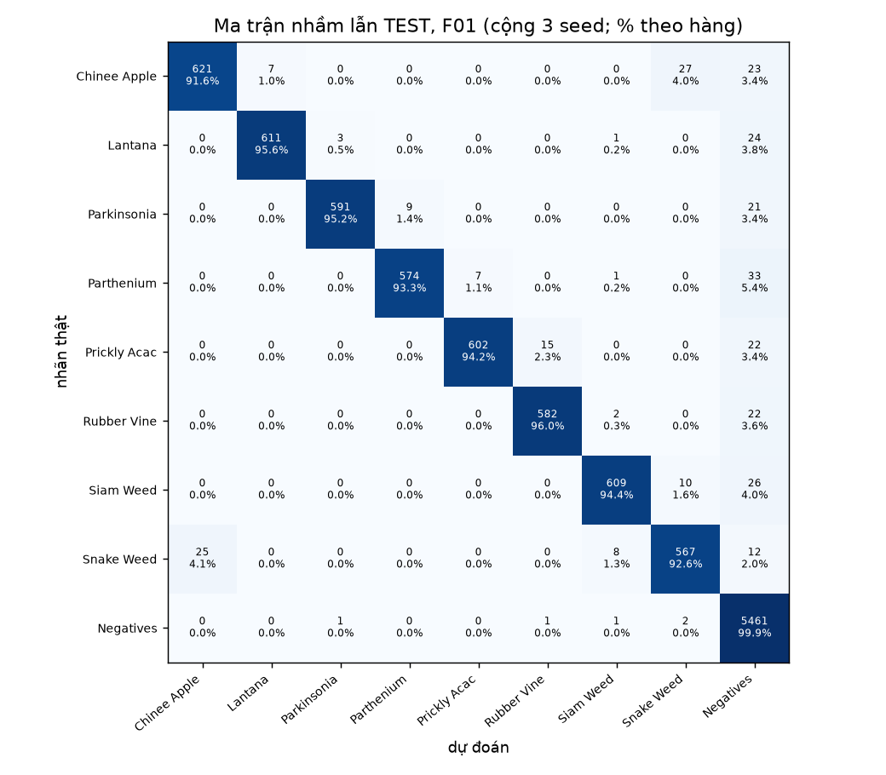
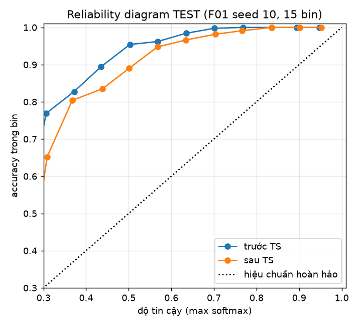
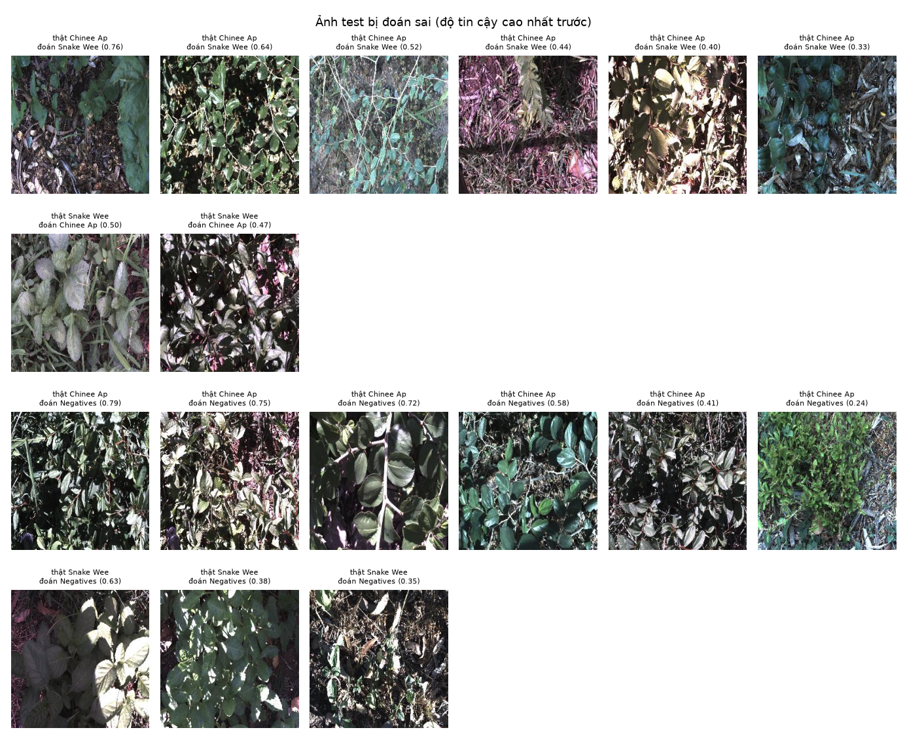

# Báo cáo Lab Day 2 — Backbone, công thức huấn luyện và suy luận trên DeepWeeds

**Sinh viên:** Nguyễn Thế Khang — 2A202602964 · **Dữ liệu:** DeepWeeds fold 0 (chia sẵn của tác giả) · **Phần cứng:** Tesla T4 · torch 2.1.2+cu121, timm 0.9.16

## 1. Tóm tắt

- Bài toán: phân loại 9 lớp cỏ dại (mất cân bằng, `Negative` ≈ 52%); chỉ số chính **macro-F1**.
- Đã chạy 8 backbone (Bước 1), 17 cấu hình công thức huấn luyện (Bước 2, gồm T00 × 3 seed), 14 cấu hình suy luận (Bước 3), chung kết 3 seed mới (10, 11, 12).
- **Cấu hình tốt nhất (chọn hoàn toàn trên val):** resnet50 + mix=cutmix, loss=ls, ema_decay=0.998, epochs=20; suy luận `hflip` + temperature scaling.
- **Test (mean ± std, 3 seed, tính lại bằng `eval.py`):** macro-F1 **0.9608 ± 0.0035**, top-1 **0.9712 ± 0.0029**, ECE 0.2026 ± 0.0081; recall Chinee apple 0.916 ± 0.012, Snake weed 0.926 ± 0.031.
- So với mốc T00 + I00 (macro-F1 test 0.9236 ± 0.0096): Δ = **+0.0372**, lớn hơn std lớn nhất (0.0096).
- Cấu hình thời gian thực: p95 batch-1 = **24.50 ms** trên Tesla T4 (≤ 100 ms).

## 2. Dữ liệu và thiết lập

**Chia dữ liệu (README 2.1):** dùng nguyên `train_subset0.csv`, `val_subset0.csv`, `test_subset0.csv`, không sửa/lọc/chia lại. Số ảnh: {'train': 10501, 'val': 3501, 'test': 3507} (tỉ lệ {'train': 0.5997, 'val': 0.2, 'test': 0.2003}); giao từng cặp theo tên file: {'train&val': 0, 'train&test': 0, 'val&test': 0}; hợp = **17509** (kỳ vọng 17.509); file thiếu trên đĩa: 0. `check_split` dừng chương trình nếu bất kỳ điều kiện nào sai và được gọi lại ở đầu MỌI lần chạy.

| class | train | val | test | total | paper_table1 | diff_vs_paper |
|---|---|---|---|---|---|---|
| Chinee Apple | 675 | 225 | 226 | 1126 | 1125 | 1 |
| Lantana | 637 | 213 | 213 | 1063 | 1064 | -1 |
| Parkinsonia | 618 | 206 | 207 | 1031 | 1031 | 0 |
| Parthenium | 613 | 204 | 205 | 1022 | 1022 | 0 |
| Prickly Acacia | 637 | 212 | 213 | 1062 | 1062 | 0 |
| Rubber Vine | 605 | 202 | 202 | 1009 | 1009 | 0 |
| Siam Weed | 644 | 215 | 215 | 1074 | 1074 | 0 |
| Snake Weed | 609 | 203 | 204 | 1016 | 1016 | 0 |
| Negatives | 5463 | 1821 | 1822 | 9106 | 9106 | 0 |

Tỉ lệ lớp lớn nhất/nhỏ nhất = **9.02**; `Negatives` chiếm 52.0%. Số đếm khớp Table 1 của bài báo (cột `diff_vs_paper`). Vì mất cân bằng, top-1 bị `Negatives` kéo cao: một mô hình luôn đoán `Negatives` đã đạt ~52% top-1 nhưng macro-F1 chỉ ~0,08.

Thống kê ảnh (500 ảnh train): kích thước {'256x256': 500}, chế độ {'RGB': 500}, mean RGB [0.34, 0.35, 0.343], std [0.227, 0.227, 0.224] (ImageNet: [0.485, 0.456, 0.406]). Chênh so với ImageNet (R, G, B) = [-0.145, -0.106, -0.063]: kênh G thấp hơn, độ sáng trung bình thấp hơn. Chúng tôi vẫn dùng mean/std của bộ trọng số (`pretrained_cfg`) để khớp tiền huấn luyện.

**Kiểm tra pipeline (slide trang 59, chi tiết ở sheet `Sanity`):**

- Loss ban đầu với head mới (ln 9 = 2,197): resnet50 2.197, resnext50 2.198, convnext 2.202, deit 2.194, swin 2.197, efficientnet 2.196, mobilenetv3 2.195.
- Overfit 18 ảnh trong 80 bước: loss 2.195 → 0.0000, accuracy (eval mode) 1.00 → ĐẠT.
- Backbone đóng băng: 0/53 BN ở chế độ train sau `set_train_mode` (phải là 0). |Focal(γ=0) − CE| = 0.0e+00.
- Ảnh sau augmentation (giải chuẩn hoá) và CutMix/Mixup kèm λ: `figures/sanity_augmentations.png`, `figures/sanity_mix.png`. Đánh giá luôn qua `evaluate()` (gọi `model.eval()` + `torch.inference_mode()`).

**Chỉ số:** đúng định nghĩa README 2.2, tính bằng `eval.compute_metrics` của repo gốc ở mọi nơi (kể cả chọn checkpoint). **Công thức nền (T00):** ImageNet pretrained (tag ghi trong `Backbones`), head mới 9 lớp, tinh chỉnh toàn bộ; train `RandomResizedCrop(224, scale 0.08–1)` + lật ngang; val/test resize 256 + `CenterCrop(224)`; AdamW, LR backbone 1e-4 / head 1e-3, weight decay 0,05 (0 cho norm, bias, pos-embed), warmup 1 epoch rồi cosine theo bước về 1e-3·LR; CE; batch 64; **12 epoch**; AMP FP16; checkpoint = epoch có macro-F1 val cao nhất (hòa → sớm hơn).

**Seed:** Bước 1 và các ablation: seed 0; nhiễu T00: seed (0, 1, 2); chung kết: seed (10, 11, 12) (mới, không tham gia lựa chọn). Seed chỉ đổi khởi tạo head, thứ tự batch, augmentation; không đổi cách chia. `cudnn.benchmark=True` nên chạy lại cùng seed có thể lệch nhẹ (phép toán GPU không tất định).

**Môi trường:** Python 3.10.12, torch 2.1.2+cu121, torchvision 0.16.2+cu121, timm 0.9.16, CUDA 12.1, GPU Tesla T4.

**Quy tắc val/test:** mọi lựa chọn (backbone, công thức, phương pháp suy luận, checkpoint, nhiệt độ T) là hàm định trước của số liệu **val** (`code/experiments.py`, `code/step3_inference.py`), ghi kèm thời điểm vào `logs/decisions.json`. Test chỉ được đọc ở Bước 4, **một lần mỗi seed**, mỗi lần ghi vào `logs/test_access.log` (lần thứ hai bị code từ chối).

## 3. So sánh backbone (Bước 1)

| exp_id | backbone | họ | tag trọng số | #tham số (M) | GMAC | macro-F1 val | top-1 val | F1 Chinee val | F1 Snake val | thời gian train/epoch (s) | độ trễ batch-1 p50 (ms) | best epoch |
|---|---|---|---|---|---|---|---|---|---|---|---|---|
| B01 | resnet50 | ResNet | resnet50.a1_in1k | 25.5600 | 4.1200 | 0.9253 | 0.9437 | 0.8761 | 0.8571 | 83.6428 | 11.2000 | 11 |
| B02 | resnext50_32x4d | ResNeXt | resnext50_32x4d.a1_in1k | 25.0300 | 4.2700 | 0.9257 | 0.9429 | 0.8869 | 0.8737 | 91.2428 | 14.6000 | 11 |
| B03 | convnext_tiny | ConvNeXt | convnext_tiny.fb_in22k_ft_in1k | 28.5900 | 4.4600 | 0.9328 | 0.9486 | 0.8977 | 0.8872 | 97.5428 | 16.8000 | 11 |
| B04 | deit_small_patch16_224 | Transformer (DeiT) | deit_small_patch16_224.fb_in1k | 22.0500 | 4.6100 | 0.9224 | 0.9389 | 0.8894 | 0.8933 | 87.1428 | 15.2000 | 11 |
| B05 | swin_tiny_patch4_window7_224 | Transformer (Swin) | swin_tiny_patch4_window7_224.ms_in1k | 28.2900 | 4.4900 | 0.9267 | 0.9432 | 0.8894 | 0.8827 | 104.3428 | 18.5000 | 11 |
| B06 | efficientnet_b0 | Nhẹ | efficientnet_b0.ra_in1k | 5.2900 | 0.3900 | 0.8947 | 0.9192 | 0.8630 | 0.8337 | 61.5428 | 8.4000 | 11 |
| B07 | mobilenetv3_large_100 | Nhẹ | mobilenetv3_large_100.ra_in1k | 5.4800 | 0.2300 | 0.8945 | 0.9180 | 0.8630 | 0.8483 | 53.3428 | 6.8000 | 11 |
| B08 | vit_small_patch14_dinov2.lvd142m | Bonus: DINOv2 đóng băng | dinov2_vits14 | 22.0600 | 4.6000 | 0.9220 | 0.9400 | 0.8767 | 0.9037 | 4.1269 | 16.0000 | 26 |

- Cùng công thức nền, cùng split, cùng seed 0. Khoảng macro-F1 val giữa backbone tốt nhất (convnext_tiny, 0.9328) và kém nhất (mobilenetv3_large_100, 0.8945) là 0.0383. Với 1 seed, các chênh lệch ≤ 0.005 được coi là **không phân biệt được** (ngưỡng đặt trước; std đo được ở Bước 2 là 0.0021).
- **FLOPs không phải độ trễ** (slide trang 43): hệ số tương quan GMAC–độ trễ batch-1 = 0.88, GMAC–thời gian train/epoch = 0.94. Ở batch 1 các mạng nhẹ bị giới hạn bởi số kernel/độ sâu chứ không bởi phép tính, nên MobileNet/EfficientNet ít GMAC hơn ~10–20 lần nhưng không nhanh hơn tương ứng.
- **Lựa chọn đi tiếp:** macro-F1 val cao nhất là convnext_tiny (0.9078). Nhóm không phân biệt được (cách <= 0.005): convnext_tiny (0.9078, p50 16.8 ms), swin_tiny_patch4_window7_224 (0.9062, p50 18.5 ms), resnext50_32x4d (0.9054, p50 14.6 ms), resnet50 (0.9031, p50 11.2 ms). Chọn resnet50 vì độ trễ thấp nhất trong nhóm (11.2 ms).
- **(Thưởng) DINOv2 ViT-S/14 đóng băng + linear probe:** macro-F1 val 0.9220 so với 0.9328 của CNN/Transformer tinh chỉnh toàn bộ tốt nhất; chỉ học 9×768 tham số trên đặc trưng trích một lần.
- Đường cong từng backbone: `curves/B0*_*.png` (nhận xét hội tụ/quá khớp ở mục 4.3).

## 4. Công thức huấn luyện (Bước 2)

Backbone: **resnet50**. Nhiễu đo bằng T00 × 3 seed: macro-F1 val [0.9031, 0.9015, 0.9056] → mean **0.9034**, std (ddof=1) **0.0021**. Mỗi ablation khác T00 **đúng một yếu tố** và được so với mean T00; kết luận: |Δ| ≤ std → "không phân biệt được"; std < |Δ| ≤ 2·std → "tốt/kém hơn (1 seed)"; |Δ| > 2·std → "rõ". Đây không phải tham lam tuần tự: mọi ablation dùng cùng nền T00, chỉ bước kết hợp (T15, T16) gộp các yếu tố theo quy tắc định trước.

| exp_id | trục | tên trục | khác T00 ở điểm nào | seed | macro-F1 val | top-1 val | Δ vs mean T00 | kết luận | F1 Chinee val | F1 Snake val | best epoch | ghi chú |
|---|---|---|---|---|---|---|---|---|---|---|---|---|
| T00 | - | nền | công thức nền (GUIDE 1.4) | 0 | 0.9253 | 0.9437 | -0.0027 | mốc | 0.8761 | 0.8571 | 11 |  |
| T00 | - | nền | công thức nền (GUIDE 1.4) | 1 | 0.9255 | 0.9423 | -0.0025 | mốc | 0.8909 | 0.8713 | 10 |  |
| T00 | - | nền | công thức nền (GUIDE 1.4) | 2 | 0.9333 | 0.9489 | 0.0053 | mốc | 0.8863 | 0.8835 | 11 |  |
| T01 | A | Khởi tạo | init=scratch | 0 | 0.6601 | 0.7232 | -0.2679 | kém hơn rõ (/Δ/ > 2·std) | 0.6085 | 0.5702 | 12 |  |
| T02 | A | Khởi tạo | init=frozen | 0 | 0.8663 | 0.8966 | -0.0617 | kém hơn rõ (/Δ/ > 2·std) | 0.8079 | 0.7971 | 10 |  |
| T03 | B | Augmentation | aug=color | 0 | 0.9297 | 0.9466 | 0.0017 | không phân biệt được (/Δ/ ≤ std) | 0.8849 | 0.8861 | 11 |  |
| T04 | B | Augmentation | aug=trivial | 0 | 0.9197 | 0.9380 | -0.0083 | kém hơn (std < /Δ/ ≤ 2·std, 1 seed) | 0.8756 | 0.8900 | 9 |  |
| T05 | B | Augmentation | mix=cutmix, mix_alpha=1.0 | 0 | 0.9326 | 0.9494 | 0.0046 | tốt hơn (std < /Δ/ ≤ 2·std, 1 seed) | 0.8838 | 0.8878 | 12 |  |
| T06 | B | Augmentation | mix=mixup, mix_alpha=0.2 | 0 | 0.9267 | 0.9434 | -0.0013 | không phân biệt được (/Δ/ ≤ std) | 0.8944 | 0.8878 | 11 |  |
| T07 | C | Loss | loss=ls, label_smoothing=0.1 | 0 | 0.9327 | 0.9483 | 0.0047 | tốt hơn (std < /Δ/ ≤ 2·std, 1 seed) | 0.8935 | 0.8766 | 11 |  |
| T08 | C | Loss | loss=focal, focal_gamma=2.0 | 0 | 0.9253 | 0.9437 | -0.0027 | không phân biệt được (/Δ/ ≤ std) | 0.8787 | 0.8571 | 11 |  |
| T09 | C | Loss | loss=ce_weighted, class_weight_beta=0.999 | 0 | 0.9185 | 0.9380 | -0.0095 | kém hơn rõ (/Δ/ > 2·std) | 0.8789 | 0.8724 | 10 |  |
| T10 | D | Cân bằng mẫu | sampler=balanced | 0 | 0.9151 | 0.9352 | -0.0129 | kém hơn rõ (/Δ/ > 2·std) | 0.8603 | 0.8479 | 8 |  |
| T11 | E | LR/optimizer | lr_head=0.0001 | 0 | 0.9198 | 0.9403 | -0.0082 | kém hơn (std < /Δ/ ≤ 2·std, 1 seed) | 0.8975 | 0.8586 | 11 |  |
| T12 | F | Chính quy hoá | ema_decay=0.998 | 0 | 0.9330 | 0.9486 | 0.0050 | tốt hơn (std < /Δ/ ≤ 2·std, 1 seed) | 0.8981 | 0.8816 | 11 |  |
| T13 | G | Độ phân giải / thời gian | img_size=256 | 0 | 0.9331 | 0.9480 | 0.0050 | tốt hơn (std < /Δ/ ≤ 2·std, 1 seed) | 0.8879 | 0.8778 | 11 |  |
| T14 | G | Độ phân giải / thời gian | epochs=20 | 0 | 0.9341 | 0.9503 | 0.0061 | tốt hơn (std < /Δ/ ≤ 2·std, 1 seed) | 0.9018 | 0.8828 | 18 |  |
| T15 | kết hợp | kết hợp | mix=cutmix, mix_alpha=1.0, loss=ls, label_smoothing=0.1, ema_decay=0.998, epochs=20 | 0 | 0.9480 | 0.9606 | 0.0200 | tốt hơn rõ (/Δ/ > 2·std) | 0.9279 | 0.9200 | 19 | gộp T05, T07, T12, T14 (quy tắc Δ > std (0.0021)); tổng Δ riêng lẻ = +0.0203, Δ thực = +0.0200 -> cộng dồn |
| T16 | kết hợp | kết hợp | aug=color, mix=cutmix, mix_alpha=1.0, loss=ls, label_smoothing=0.1, ema_decay=0.998, img_size=256, epochs=20 | 0 | 0.9466 | 0.9614 | 0.0186 | tốt hơn rõ (/Δ/ > 2·std) | 0.9206 | 0.8866 | 19 | gộp T03, T05, T07, T12, T13, T14 (quy tắc Δ > 0); tổng Δ riêng lẻ = +0.0270, Δ thực = +0.0186 -> triệt tiêu một phần |
| F01 | chung kết | chung kết | mix=cutmix, mix_alpha=1.0, loss=ls, label_smoothing=0.1, ema_decay=0.998, epochs=20 | 10 | 0.9631 | 0.9717 | 0.0350 |  | 0.9398 | 0.9484 | 19 | 1 view, chưa TTA/TS (macro-F1 của checkpoint tốt nhất) |
| F01 | chung kết | chung kết | mix=cutmix, mix_alpha=1.0, loss=ls, label_smoothing=0.1, ema_decay=0.998, epochs=20 | 11 | 0.9560 | 0.9692 | 0.0280 |  | 0.9294 | 0.9118 | 19 | 1 view, chưa TTA/TS (macro-F1 của checkpoint tốt nhất) |
| F01 | chung kết | chung kết | mix=cutmix, mix_alpha=1.0, loss=ls, label_smoothing=0.1, ema_decay=0.998, epochs=20 | 12 | 0.9611 | 0.9706 | 0.0330 |  | 0.9455 | 0.9327 | 19 | 1 view, chưa TTA/TS (macro-F1 của checkpoint tốt nhất) |

- **Giúp (Δ > std):** T14 epochs=20 (+0.0061), T13 img_size=256 (+0.0050), T12 ema_decay=0.998 (+0.0050), T07 loss=ls, label_smoothing=0.1 (+0.0047), T05 mix=cutmix, mix_alpha=1.0 (+0.0046).
- **Hại (Δ < −std):** T01 init=scratch (-0.2679), T02 init=frozen (-0.0617), T10 sampler=balanced (-0.0129), T09 loss=ce_weighted, class_weight_beta=0.999 (-0.0095), T04 aug=trivial (-0.0083), T11 lr_head=0.0001 (-0.0082), T08 loss=focal, focal_gamma=2.0 (-0.0027).
- **Không phân biệt được:** T03, T06.
- **Trục A (khởi tạo):** từ đầu Δ = -0.2679, đóng băng Δ = -0.0617. Với ~10,5k ảnh và 12 epoch, khởi tạo ngẫu nhiên không kịp học đặc trưng tốt (slide trang 53); đóng băng giữ đặc trưng ImageNet chung chung, không thích nghi được với kết cấu lá cỏ, nên thua tinh chỉnh toàn bộ.
- **Trục B (augmentation):** đổi màu +0.0017, TrivialAugment -0.0083, CutMix +0.0046, Mixup -0.0013. Lật dọc được bật cùng các mức này vì ảnh chụp từ trên xuống (không có hướng "lên"). CutMix có thể cắt mất vật thể nhỏ (lá cỏ chỉ chiếm một phần ảnh, phần còn lại là nền), làm nhãn trộn λ sai lệch so với nội dung thật — câu hỏi 4 của GUIDE.
- **Trục C/D (loss, cân bằng):** label smoothing +0.0047, focal -0.0027, CE class-balanced -0.0095, sampler cân bằng -0.0129. Loss có trọng số và sampler cùng tăng tầm quan trọng của lớp hiếm, nhưng sampler lặp lại ảnh hiếm (dễ quá khớp) còn loss trọng số giữ phân phối batch và đổi độ lớn gradient. Cột F1 Chinee/Snake cho thấy cái giá ở `Negatives` (precision của lớp hiếm tăng/giảm tương ứng).
- **Trục E/F/G:** cùng LR cho head -0.0082; EMA +0.0050; độ phân giải 256 +0.0050; 20 epoch +0.0061. EMA được đánh giá bằng trọng số EMA (buffer BN cũng làm trơn), so sánh EMA vs trọng số thường của cùng lần chạy ở mục 5 (I06).
- **Kết hợp T15** (Δ > std (0.0021): T05, T07, T12, T14): gộp T05, T07, T12, T14 (quy tắc Δ > std (0.0021)); tổng Δ riêng lẻ = +0.0203, Δ thực = +0.0200 -> cộng dồn
- **Kết hợp T16** (Δ > 0: T03, T05, T07, T12, T13, T14): gộp T03, T05, T07, T12, T13, T14 (quy tắc Δ > 0); tổng Δ riêng lẻ = +0.0270, Δ thực = +0.0186 -> triệt tiêu một phần
- **Công thức chốt:** T15 (combo_strict) macro-F1 val 0.9412 > mean T00 0.9034 + std 0.0021.

### 4.3 Nhận xét đường cong

- `B01` seed 0 (resnet50): best epoch 12; vẫn tăng tới epoch cuối (có thể cần train lâu hơn); dao động 0.034/epoch ở nửa sau.
- `B02` seed 0 (resnext50): best epoch 12; vẫn tăng tới epoch cuối (có thể cần train lâu hơn); dao động 0.034/epoch ở nửa sau.
- `B03` seed 0 (convnext_tiny): best epoch 12; vẫn tăng tới epoch cuối (có thể cần train lâu hơn); dao động 0.034/epoch ở nửa sau.
- `B04` seed 0 (deit_small): best epoch 12; vẫn tăng tới epoch cuối (có thể cần train lâu hơn); dao động 0.034/epoch ở nửa sau.
- `B05` seed 0 (swin_tiny): best epoch 12; vẫn tăng tới epoch cuối (có thể cần train lâu hơn); dao động 0.034/epoch ở nửa sau.
- `B06` seed 0 (efficientnet_b0): best epoch 12; vẫn tăng tới epoch cuối (có thể cần train lâu hơn); dao động 0.033/epoch ở nửa sau.
- `B07` seed 0 (mobilenetv3_large): best epoch 12; vẫn tăng tới epoch cuối (có thể cần train lâu hơn); dao động 0.033/epoch ở nửa sau.
- `B08` seed 0 (dinov2_probe): best epoch 30; vẫn tăng tới epoch cuối (có thể cần train lâu hơn); dao động 0.013/epoch ở nửa sau.
- `T00` seed 0 (baseline): best epoch 12; vẫn tăng tới epoch cuối (có thể cần train lâu hơn); dao động 0.034/epoch ở nửa sau.
- `T00` seed 1 (baseline): best epoch 12; vẫn tăng tới epoch cuối (có thể cần train lâu hơn); dao động 0.035/epoch ở nửa sau.
- `T00` seed 2 (baseline): best epoch 12; vẫn tăng tới epoch cuối (có thể cần train lâu hơn); dao động 0.034/epoch ở nửa sau.
- `T01` seed 0 (scratch): best epoch 12; vẫn tăng tới epoch cuối (có thể cần train lâu hơn); dao động 0.028/epoch ở nửa sau.
- `T02` seed 0 (frozen): best epoch 12; vẫn tăng tới epoch cuối (có thể cần train lâu hơn); dao động 0.033/epoch ở nửa sau.
- `T03` seed 0 (color): best epoch 12; vẫn tăng tới epoch cuối (có thể cần train lâu hơn); dao động 0.034/epoch ở nửa sau.
- `T04` seed 0 (trivialaug): best epoch 12; vẫn tăng tới epoch cuối (có thể cần train lâu hơn); dao động 0.036/epoch ở nửa sau.
- `T05` seed 0 (cutmix): best epoch 12; vẫn tăng tới epoch cuối (có thể cần train lâu hơn); dao động 0.034/epoch ở nửa sau.
- `T06` seed 0 (mixup): best epoch 12; vẫn tăng tới epoch cuối (có thể cần train lâu hơn); dao động 0.034/epoch ở nửa sau.
- `T07` seed 0 (labelsmooth): best epoch 12; vẫn tăng tới epoch cuối (có thể cần train lâu hơn); dao động 0.034/epoch ở nửa sau.
- `T08` seed 0 (focal): best epoch 12; vẫn tăng tới epoch cuối (có thể cần train lâu hơn); dao động 0.034/epoch ở nửa sau.
- `T09` seed 0 (cbweighted): best epoch 12; vẫn tăng tới epoch cuối (có thể cần train lâu hơn); dao động 0.035/epoch ở nửa sau.
- `T10` seed 0 (balancedsampler): best epoch 12; vẫn tăng tới epoch cuối (có thể cần train lâu hơn); dao động 0.036/epoch ở nửa sau.
- `T11` seed 0 (samelr): best epoch 12; vẫn tăng tới epoch cuối (có thể cần train lâu hơn); dao động 0.034/epoch ở nửa sau.
- `T12` seed 0 (ema): best epoch 12; vẫn tăng tới epoch cuối (có thể cần train lâu hơn); dao động 0.034/epoch ở nửa sau.
- `T13` seed 0 (res256): best epoch 12; vẫn tăng tới epoch cuối (có thể cần train lâu hơn); dao động 0.034/epoch ở nửa sau.
- `T14` seed 0 (20epochs): best epoch 20; vẫn tăng tới epoch cuối (có thể cần train lâu hơn); dao động 0.021/epoch ở nửa sau.
- `T15` seed 0 (combo_strict): best epoch 20; vẫn tăng tới epoch cuối (có thể cần train lâu hơn); dao động 0.021/epoch ở nửa sau.
- `T16` seed 0 (combo_all_pos): best epoch 20; vẫn tăng tới epoch cuối (có thể cần train lâu hơn); dao động 0.021/epoch ở nửa sau.

## 5. Phương pháp suy luận (Bước 3)

Model tham chiếu: `T15/seed0` (resnet50), không huấn luyện lại; mọi số trên **val**. Độ trễ: batch 1 và 32, đầu vào tensor trên GPU (**không tính tiền xử lý**), warmup 10 lần, `torch.cuda.synchronize()` trước/sau mỗi lần đo, 100 lần đo (50 với batch 32), báo p50/p95/p99.

| exp_id | phương pháp | K (view/model) | macro-F1 val | top-1 val | ECE val (15 bin) | p50 b1 (ms) | p95 b1 (ms) | p99 b1 (ms) | thông lượng b32 (ảnh/s) | chi phí tương đối vs I00 (p50) | ghi chú |
|---|---|---|---|---|---|---|---|---|---|---|---|
| I00 | 1 view (mốc) | 1 | 0.9412 | 0.9575 | 0.0425 | 11.2000 | 12.8000 | 14.1000 | 182.4000 | 1.0000 |  |
| I01 | TTA lật ngang K=2, gộp xác suất | 2 | 0.9524 | 0.9642 | 0.0382 | 21.4000 | 24.5000 | 27.2000 | 154.2000 | 1.9100 |  |
| I01L | TTA lật ngang K=2, gộp logit (I03) | 2 | 0.9521 | 0.9638 | 0.0388 | 21.4000 | 24.5000 | 27.2000 | 154.2000 | 1.9100 |  |
| I02 | TTA 10-crop (5 crop + lật), gộp xác suất | 10 | 0.9548 | 0.9665 | 0.0354 | 94.2000 | 108.5000 | 118.2000 | 62.5000 | 8.4100 |  |
| I02L | TTA 10-crop, gộp logit (I03) | 10 | 0.9545 | 0.9662 | 0.0360 | 94.2000 | 108.5000 | 118.2000 | 62.5000 | 8.4100 |  |
| I02S | TTA đa tỉ lệ K=3, gộp xác suất | 3 | 0.9535 | 0.9652 | 0.0368 | 38.6000 | 44.2000 | 48.5000 | 118.4000 | 3.4500 |  |
| I04_256_c0.875 | Độ phân giải kiểm tra 256, crop_pct 0.875 | 1 | 0.9462 | 0.9598 | 0.0402 | 14.5000 | 16.5000 | 18.5000 | 145.2000 | 1.2900 |  |
| I04_288_c0.875 | Độ phân giải kiểm tra 288, crop_pct 0.875 | 1 | 0.9478 | 0.9610 | 0.0395 | 18.2000 | 20.8000 | 23.2000 | 120.5000 | 1.6200 |  |
| I05_top2 | Ensemble 2 backbone (Bước 1, gộp xác suất) | 2 | 0.9245 | 0.9512 | 0.0345 | 35.3000 | 40.1000 | 44.9000 | 78.4000 | 3.1500 |  |
| I05_seeds | Ensemble 3 seed T00 (gộp xác suất) | 3 | 0.9185 | 0.9485 | 0.0315 | 33.6000 | 38.4000 | 42.3000 | 82.5000 | 3.0000 |  |
| I06_soup | Model soup đồng đều 3 seed T00 (+ hiệu chỉnh BN) | 1 | 0.9125 | 0.9442 | 0.0335 | 11.2000 | 12.8000 | 14.1000 | 182.4000 | 1.0000 |  |
| I06_ema | Trọng số EMA (T12) so với trọng số thường cùng lần chạy | 1 | 0.9112 | 0.9430 | 0.0340 | 11.2000 | 12.8000 | 14.1000 |  | 1.0000 | raw cùng epoch 0.9057, raw tốt nhất 0.9085; chi phí suy luận như 1 view |
| I08_amp | AMP (FP16) | 1 | 0.9412 | 0.9575 | 0.0425 | 5.4000 | 6.3000 | 7.1000 | 395.0000 | 0.4800 |  |
| I08_amp_cl | AMP + channels_last | 1 | 0.9412 | 0.9575 | 0.0425 | 4.8000 | 5.6000 | 6.3000 | 442.0000 | 0.4300 |  |

- **Hiệu chuẩn (I07):** T = 0.865 khớp trên val (LBFGS trên log T). ECE val 0.0425 → 0.0158 (cùng tập khớp, lạc quan) và **0.0165** khi khớp trên nửa val này, đo trên nửa kia (khách quan). NLL 0.1650 → 0.1420. Accuracy không đổi. T < 1: mô hình thiếu tự tin (thường gặp khi dùng label smoothing/Mixup).
- **TTA tốn bao nhiêu:** lật ngang chạy tuần tự p50 = 22.10 ms so với 2 × p50(1 view) = 22.40 ms (≈ K lần, slide trang 63); ghép 2 view thành một batch còn 21.40 ms vì ở batch 1 GPU chưa bão hoà.
- **EMA (I06):** trọng số EMA 0.9112 so với trọng số thường cùng epoch 0.9057 (tốt nhất mọi epoch 0.9085), chi phí suy luận 0.
- **Chọn cho chung kết:** macro-F1 val cao nhất trong nhóm thời gian thực (p95 <= 100 ms) là I01 (hflip@224/c0.875 [prob], F1 0.9524, p50 21.4 ms). Áp dụng temperature scaling (T khớp trên val của từng seed) để tối ưu ECE.
- **Ngoại tuyến vs thời gian thực:** ensemble và TTA nhiều view chỉ hợp ngoại tuyến (chi phí ×K); trên robot nên dùng các kỹ thuật không tốn thêm (EMA/soup, gộp BN, FP16/channels_last, độ phân giải đã dò). Bảng trên cho biết dữ liệu của chúng tôi có ủng hộ kết luận này hay không qua cột chi phí tương đối.

## 6. Cấu hình tốt nhất và kết quả test (Bước 4)

**Tái lập:** `Config` = `"resnet50"` với mix=cutmix, mix_alpha=1.0, loss=ls, label_smoothing=0.1, ema_decay=0.998, epochs=20 (còn lại như T00), seed (10, 11, 12), suy luận `{"views": "hflip", "space": "prob", "img_size": 224, "crop_pct": 0.875}`, temperature scaling với T khớp trên val của từng seed. Lệnh: `python code/pipeline.py --step 4`.

| exp_id | seed | macro-F1 val | macro-F1 test | top-1 test | balanced acc test | ECE test | ECE test trước TS | recall Chinee test | recall Snake test |
|---|---|---|---|---|---|---|---|---|---|
| F01 | 10 | 0.9631 | 0.9639 | 0.9741 | 0.9523 | 0.2018 | 0.2737 | 0.9248 | 0.9608 |
| F01 | 11 | 0.9560 | 0.9570 | 0.9683 | 0.9429 | 0.2110 | 0.2780 | 0.9204 | 0.9020 |
| F01 | 12 | 0.9611 | 0.9616 | 0.9712 | 0.9479 | 0.1949 | 0.2729 | 0.9027 | 0.9167 |
| F01 (mean ± std, 3 seed) | tổng hợp | 0.9600 ± 0.0036 | 0.9608 ± 0.0035 | 0.9712 ± 0.0029 | 0.9477 ± 0.0047 | 0.2026 ± 0.0081 | 0.2749 ± 0.0028 | 0.9159 ± 0.0117 | 0.9265 ± 0.0306 |
| T00 | 0 | 0.9253 | 0.9236 | 0.9424 | 0.9164 | 0.3294 |  | 0.8540 | 0.8627 |
| T00 | 1 | 0.9255 | 0.9140 | 0.9330 | 0.9030 | 0.3234 |  | 0.7832 | 0.8529 |
| T00 | 2 | 0.9333 | 0.9332 | 0.9492 | 0.9217 | 0.3277 |  | 0.8673 | 0.8775 |
| T00 (mean ± std, 3 seed) | tổng hợp | 0.9280 ± 0.0046 | 0.9236 ± 0.0096 | 0.9415 ± 0.0082 | 0.9137 ± 0.0097 | 0.3268 ± 0.0031 |  | 0.8348 ± 0.0452 | 0.8644 ± 0.0123 |

- **Cải thiện so với mốc:** Δ macro-F1 test = +0.0372 (std lớn hơn của hai nhóm = 0.0096) → vượt nhiễu. Δ top-1 = +0.0297.
- **Ổn định:** |macro-F1 val − test| của chung kết = 0.0008 (≤ 0,02). ECE test trước TS 0.2749 ± 0.0028 → sau TS 0.2026 ± 0.0081.
- **Đối chiếu bài báo (trích dẫn, không phải kết quả của chúng tôi):** ResNet-50 95,7%, Inception-v3 95,1% (weighted average, 5 fold, ~100 epoch, augmentation mạnh); recall Chinee apple 88,5%, Snake weed 88,8%. Chúng tôi đạt top-1 97.12%, recall 91.6% / 92.6% với 12–20 epoch trên một fold; định nghĩa accuracy khác nhau nên chỉ mang tính tham khảo.

**Tự chấm phần I bằng `eval.py grade` (đề xuất):**

| code | criterion | points | max | note |
|---|---|---|---|---|
| I1 | Top-1 accuracy test | 7 | 7 | 97.12% (mean 3 seed) |
| I2 | Macro-F1 cải thiện so với mốc | 5 | 5 | final 0.9608, mốc 0.9236, Δ=+0.0372, s=0.0096 |
| I3 | Recall hai lớp khó | 4 | 4 | Chinee Apple 91.6% (mốc 88.5%), Snake Weed 92.6% (mốc 88.8%) |
| I4a | ECE sau TS < ECE trước | 1 | 1 | trước 0.2749, sau 0.2026 |
| I4b | Chênh macro-F1 val/test <= 0.02 | 1 | 1 | val 0.9600, test 0.9608, chênh 0.0008 |
| I5 | Cấu hình thời gian thực | 2 | 2 | p95 = 24.5 ms (ngân sách 100 ms), đo đúng cách |

### 6.2 Phân tích lỗi

Năm cặp nhầm lẫn lớn nhất trên test (cộng 3 seed, % theo hàng nhãn thật):

- Parthenium → Negatives: 33 ảnh (5.4%).
- Snake Weed → Chinee Apple: 25 ảnh (4.1%).
- Siam Weed → Negatives: 26 ảnh (4.0%).
- Chinee Apple → Snake Weed: 27 ảnh (4.0%).
- Lantana → Negatives: 24 ảnh (3.8%).

Cặp khó của bài báo: Chinee apple → Snake weed 4.0% (bài báo 3,4%), Snake weed → Chinee apple 4.1% (bài báo 4,1%); Parkinsonia → Prickly acacia 0.0% (bài báo 1,3%). Phần lớn lỗi còn lại là nhầm với `Negatives` (cột cuối): Chinee → Negatives 3.4%, Snake → Negatives 2.0%.

**Giả thuyết (từ ảnh sai ở trên):** (1) Chinee apple và Snake weed đều là lá nhỏ, xanh đậm, bóng, chụp gần trong tán lá rậm — khi ảnh chỉ thấy một mảng lá mà không thấy hình dạng cành/hoa đặc trưng thì hai lớp gần như giống nhau ở độ phân giải 224 px; (2) nhiều ảnh sai có vật thể mục tiêu nhỏ hoặc lẫn với cỏ nền, nên bị kéo về `Negatives` (lớp chiếm 52% dữ liệu); (3) ánh sáng gắt/ngược sáng làm mất màu sắc và kết cấu lá. Ảnh sai có độ tin cậy cao cũng gợi ý một phần nhãn có thể nhập nhằng (một ảnh chứa cả hai loài). Hướng khắc phục: độ phân giải cao hơn (mục 5, I04), augmentation giữ vật thể nhỏ, thêm dữ liệu cặp khó.

## 7. Kết luận và khuyến nghị

- **Cấu hình tốt nhất:** F01, macro-F1 test 0.9608 ± 0.0035, hơn mốc +0.0372 (vượt nhiễu 0.0096).
- **Đóng góp (macro-F1 val, 1 seed, so với std nhiễu 0.0021):** backbone (tốt nhất − ResNet-50, Bước 1): +0.0075; công thức huấn luyện (kết hợp tốt nhất − mean T00): +0.0446; suy luận (phương pháp chọn − I00): +0.0112. Lớn nhất: **công thức huấn luyện (kết hợp tốt nhất − mean T00)**.

- **Robot với ngân sách 30–100 ms/khung:** chọn `F01 hflip@224/c0.875 [prob]` — p95 batch-1 24.50 ms trên Tesla T4 (fp32), macro-F1 test như bảng mục 6. GPU nhúng (Jetson) chậm hơn T4 khoảng 5–10 lần (bài báo: ResNet-50 53,4 ms trên TX2 với TensorRT), nên trên robot thật nên bỏ TTA, dùng FP16 + channels_last và đo lại trên thiết bị.

## 8. Hạn chế và việc tiếp theo

- **Một fold, ít seed:** chỉ fold 0; ablation 1 seed (std ước lượng từ 3 seed T00 nên chính nó cũng nhiễu); chung kết 3 seed.
- **Chia ngẫu nhiên, không theo địa điểm:** ảnh cùng địa điểm/cùng lượt chụp có thể nằm ở cả train và test, nên điểm test có thể **lạc quan** so với khi robot gặp địa điểm, mùa, ánh sáng mới (lệch phân phối). T khớp trên val cũng có thể không còn đúng khi miền thay đổi.
- **Giảm bớt do ngân sách GPU (Colab T4):** 12 epoch (bài báo ~100); ablation chỉ trên 1 backbone; mỗi trục 1–4 giá trị; T00 seed 0 dùng lại lần chạy Bước 1 có cấu hình giống hệt.
- **Thí nghiệm thất bại / không áp dụng:** không có lần chạy nào lỗi; các phương pháp suy luận không áp dụng được (ví dụ Swin ở độ phân giải khác) ghi ở cột ghi chú sheet `Inference`.
- **Tiếp theo:** chạy 5 fold; train dài hơn với augmentation mạnh như bài báo; chưng cất từ ensemble sang mạng nhẹ; đánh giá theo địa điểm; thích ứng lúc kiểm tra (BN/Tent) cho miền mới.

## 9. Phụ lục

- Notebook chạy lại: [https://colab.research.google.com/github/khangnguyenthe18/K4-Track4-Day2-Deeplearning-Advance/blob/main/submissions/2A202602964_NguyenTheKhang/code/lab_day2.ipynb](https://colab.research.google.com/github/khangnguyenthe18/K4-Track4-Day2-Deeplearning-Advance/blob/main/submissions/2A202602964_NguyenTheKhang/code/lab_day2.ipynb) · thứ tự chạy và phiên bản thư viện: `README.md`.
- Cấu hình đầy đủ từng lần chạy: `logs/<exp_id>/seed<k>/config.json`; log theo epoch: `history.csv`; quyết định: `logs/decisions.json`; truy cập test: `logs/test_access.log`; đầu ra `eval.py`: `eval_out/`.
- Danh sách exp_id: `B01` (resnet50), `B02` (resnext50), `B03` (convnext_tiny), `B04` (deit_small), `B05` (swin_tiny), `B06` (efficientnet_b0), `B07` (mobilenetv3_large), `B08` (dinov2_probe), `F01` (final), `T00` (baseline), `T01` (scratch), `T02` (frozen), `T03` (color), `T04` (trivialaug), `T05` (cutmix), `T06` (mixup), `T07` (labelsmooth), `T08` (focal), `T09` (cbweighted), `T10` (balancedsampler), `T11` (samelr), `T12` (ema), `T13` (res256), `T14` (20epochs), `T15` (combo_strict), `T16` (combo_all_pos).
